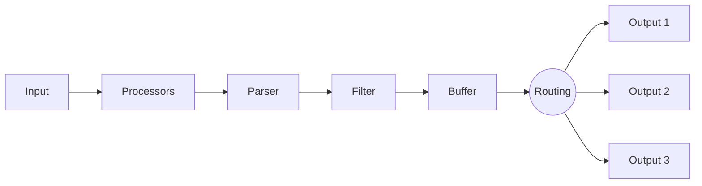

# Data pipeline

The Fluent Bit data pipeline incorporates several specific concepts. Data processing flows through the pipeline following these concepts in order.

## Inputs

[Input plugins](../pipeline/inputs.md) gather information from different sources. Some plugins collect data from log files, and others gather metrics information from the operating system. There are many plugins to suit different needs.

## Processors

[Processors](../pipeline/processors.md) are components that modify, transform, or enhance data as it flows through the pipeline. Processors are attached directly to individual input or output plugins rather than defined globally, and they don't use tag matching.

Because processors run in the same thread as their associated plugin, they can reduce performance overhead compared to filters—especially when [multithreading](../administration/multithreading.md) is enabled.

Processors are configured in [YAML configuration files](../administration/configuring-fluent-bit/yaml.md) only.

## Parser

[Parsers](../pipeline/parsers.md) convert unstructured data to structured data. Use a parser to set a structure to the incoming data by using input plugins as data is collected.

## Filter

[Filters](../pipeline/filters.md) let you alter the collected data before delivering it to a destination. In production environments you need full control of the data you're collecting. Using filters lets you control data before processing.

## Buffer

The [buffering](../pipeline/buffering.md) phase in the pipeline aims to provide a unified and persistent mechanism to store your data, using the primary in-memory model or the file system-based mode.

## Routing

[Routing](../pipeline/router.md) is a core feature that lets you route your data through filters, and then to one or multiple destinations. The router relies on the concept of [tags](./key-concepts.md#tag) and [matching](./key-concepts.md#match) rules.

## Output

[Output plugins](../pipeline/outputs.md) let you define destinations for your data. Common destinations are remote services, local file systems, or other standard interfaces.
